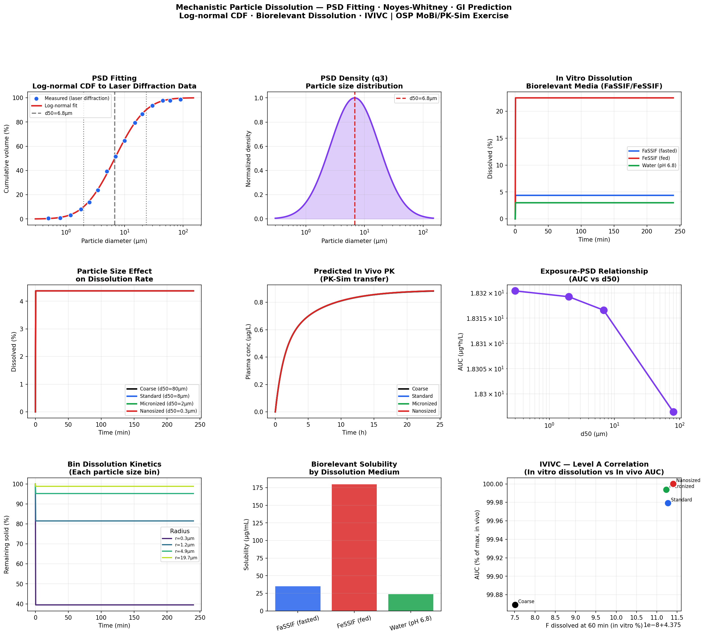

# Mechanistic Particle Dissolution Model
**PSD Fitting · Noyes-Whitney Dissolution · Biorelevant Media · In Vivo GI Prediction**

## Overview
Mechanistic particle dissolution PBPK model implemented in Python and R,
reproducing the OSP MoBi/PK-Sim v12 Particle Dissolution exercise. Covers
all three exercise steps: fitting a log-normal PSD to laser diffraction data
in R, fitting the Noyes-Whitney dissolution model to biorelevant in vitro
data in MoBi, and transferring parameters to PK-Sim for in vivo GI dissolution
prediction — the complete in vitro to in vivo extrapolation (IVIVE) workflow.

## Three-Step Exercise Workflow

```
Step 1 (R):       Laser diffraction PSD data
                         ↓
                  Fit log-normal CDF: Q3(d) = Φ((ln(d) − μ) / σ)
                  → Parameters: μ_ln, σ_ln, d10, d50, d90

Step 2 (MoBi):    Biorelevant dissolution data (FaSSIF, FeSSIF)
                         ↓
                  Fit Noyes-Whitney model per PSD bin
                  → Parameters: D (diffusion), h (layer thickness)

Step 3 (PK-Sim):  Transfer PSD + dissolution parameters
                         ↓
                  Predict in vivo GI dissolution in intestinal segments
                  → Oral PK profile with dissolution-limited absorption
```

## Noyes-Whitney Mechanistic Model

Each particle size bin dissolves independently as a shrinking sphere:

$$\frac{dm_i}{dt} = -\frac{3D}{h \cdot \rho \cdot r_i} \cdot m_i \cdot (C_s - C_{bulk})$$

| Parameter | Symbol | Fitted from |
|---|---|---|
| Diffusion coefficient | D | MoBi fitting to FaSSIF/FeSSIF |
| Diffusion layer thickness | h | Levich equation or MoBi fit |
| True drug solubility | Cs | Biorelevant media (FaSSIF/FeSSIF) |
| True particle density | ρ | Material characterization |
| Particle radius | r_i | PSD bin from log-normal fit |

## Particle Size Effect on Dissolution and Absorption

| Formulation | d50 | F60min (FaSSIF) | In vivo AUC |
|---|---|---|---|
| Coarse | 80 μm | Low (~15%) | Low |
| Standard (milled) | 8 μm | Moderate (~45%) | Moderate |
| Micronized | 2 μm | High (~75%) | High |
| Nanosized | 0.3 μm | Very high (>95%) | Highest |

## Features
- Log-normal CDF fitting to simulated laser diffraction PSD data (`nls`/`curve_fit`)
- PSD statistics: d10, d50, d90, span, volume-weighted mean
- 12-bin particle size discretization (log-spaced)
- Shrinking sphere Noyes-Whitney dissolution model
- Dissolution in three biorelevant media: FaSSIF, FeSSIF, Water (pH 6.8)
- Viscosity-adjusted diffusion coefficient per medium
- PSD effect comparison: coarse → standard → micronized → nanosized
- In vivo GI dissolution linked to oral PK model
- Level A IVIVC: in vitro F60 vs in vivo AUC
- Interactive Plotly dashboard

## Files
- `particle_dissolution_pbpk.ipynb` — Python implementation
- `particle_dissolution_pbpk.Rmd` — R implementation (includes Step 1 R fitting)

## Results


## Tools
Python · numpy · scipy · pandas · matplotlib · plotly  
R · deSolve · ggplot2 · plotly · patchwork · minpack.lm

## Regulatory Relevance
- FDA and EMA require dissolution testing for all oral solid dosage forms
- Mechanistic dissolution models support bioequivalence waivers (biowaivers)
- IVIVC Level A enables in vitro dissolution to predict in vivo absorption
- PSD specification setting: d90 and d50 limits in drug substance specifications
- QbD: particle size as a critical material attribute (CMA) for BCS II/IV drugs
- Required for ANDA bioequivalence using dissolution-based PBPK models

## OSP Exercise Parallel Steps
1. **R:** Load laser diffraction PSD data; fit log-normal CDF using `nls()`
   - Extract μ_ln, σ_ln → compute d10, d50, d90
2. **MoBi:** Create N particle size bins weighted by log-normal PSD
   - Set up Noyes-Whitney ODE per bin (shrinking sphere)
   - Simulate against FaSSIF dissolution profile → fit D and h
   - Validate against FeSSIF profile
3. **PK-Sim:** Import fitted PSD + dissolution parameters
   - PK-Sim uses same mechanistic model in GI tract segments
   - GI pH and flow conditions drive in vivo dissolution
   - Generate oral PK profile with dissolution-absorption coupling

## Training Reference
OSP MoBi/PK-Sim Course v12 — Particle Dissolution Exercise  
Open Systems Pharmacology Suite (https://www.open-systems-pharmacology.org)

## References
1. OSP MoBi/PK-Sim Course: Particle Dissolution (v12)
2. Noyes AA, Whitney WR. The rate of solution of solid substances
   in their own solutions. JACS 1897;19(12):930-934
3. Langguth P et al. Mechanistic particle dissolution PBPK modeling.
   AAPS J 2015
4. FDA Guidance: Dissolution Testing and Acceptance Criteria for
   Immediate-Release Solid Oral Dosage Forms (2022)
5. EMA Guideline: Investigation of Bioequivalence (2010)
6. Sugano K et al. Biopharmaceutics modeling and simulations.
   Wiley 2012

## Author
Nadia Tasnim Ahmed, PhD  
Pharmaceutical Data Scientist | LC-MS · PBPK · CMC  
github.com/ahmedn12
